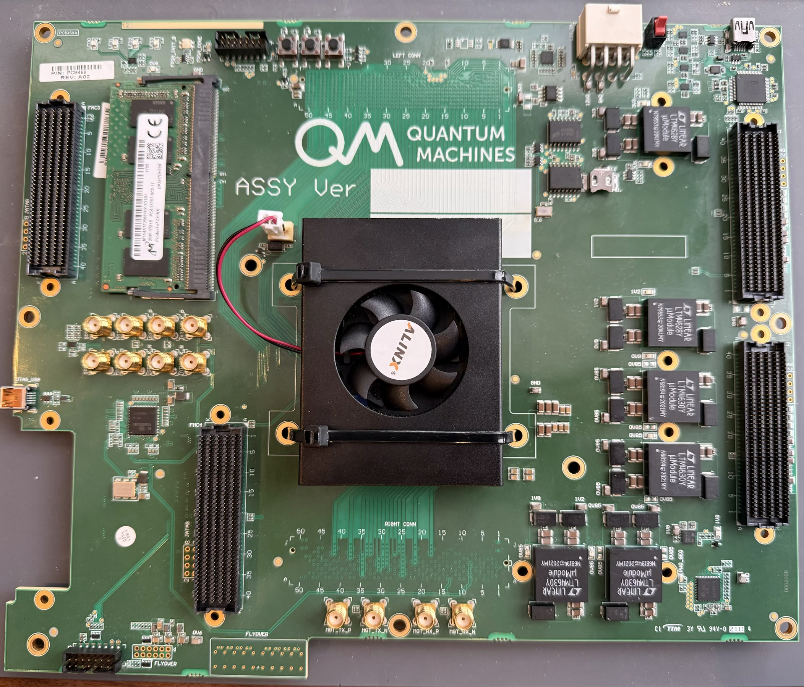
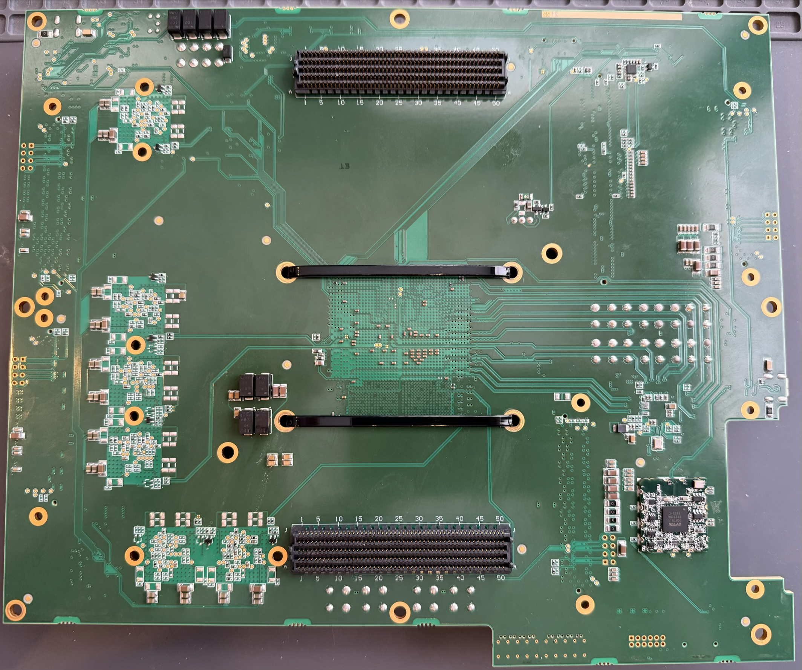

# QMVU13P
Reverse engineering notes (and blinky) for a Quantum Machines Xilinx Virtex Ultrascale+ board with an XCVU13P on it.

(Notes below the pictures)

**Top**

**Bottom**

## On-board USB JTAG
- Digilent HS2 compatible (worked with OpenFPGALoader)
- Appears to be a [JTAG-SMT2-NC](https://digilent.com/shop/jtag-smt2-nc-surface-mount-programming-module/)
- Connects to "JTAG_USB" USB mini connector

## Configuration memory
- Looks like this Micron quad SPI flash: [MT25QU01GBBB8ESF-0AAT](https://mm.digikey.com/Volume0/opasdata/d220001/medias/docus/2293/MT25QU01GBBB_DS.pdf)

## LEDs
| Silkscreen Label | FPGA Pin |  VCCO | IO Standard |
|------------------|:--------:|:-----:|-------------|
| LED0             |   BB32   | 1.2 V | LVCMOS12    |
| LED1             |   BF32   | 1.2 V | LVCMOS12    |
| LED2             |   AN25   | 1.2 V | LVCMOS12    |
| LED3             |   AR28   | 1.2 V | LVCMOS12    |

## SMA GPIOs
- Two SMA connector GPIOs (near the clock gen section)
- Through level converter with direction control line to switch between input or output
    - Matches [SN74AVC4T245 in RSV package (UQFN 2.6x1.8 mm)](https://www.ti.com/lit/ds/symlink/sn74avc4t245.pdf)
    - Translate 1.8 V FPGA IO to 3.3 V

| SMA GPIO | FPGA IO Pin | FPGA Dir Pin |  VCCO | IO Standard |
|----------|:-----------:|:------------:|:-----:|-------------|
| GPIO2    |     AW22    |     AW23     | 1.8 V | LVCMOS18    |
| GPIO3    |     BA21    |     BC24     | 1.8 V | LVCMOS18    |

## Clocks
### Config clock
- EMCCLK is used for 100 MHz configuration from two external flash chips
- Can be used as a clock, but not recommended
    - Not routed to a clock input
    - Goes through a CLB, so more jitter
    - Used for blinky since jitter doesn't matter for that

### Clock generator
Si5345 and a Si570 form an arbitrary clock generator with many outputs

### Si5345
- I2C_SEL pulled up, selecting I2C config mode
- I2C bus goes to level translator to the right of power connector
    - From there, it goes to the FTDI FT4232HL channel A

| Si5345 Port |   FPGA Pins   |   FPGA Port  | FPGA Bank | Other Connection            |
|-------------|:-------------:|:------------:|:---------:|-----------------------------|
| IN0         |               |              |           | Si570 clk out               |
| IN1         |               |              |           | JATN_CLK SMA                |
| IN2         |               |              |           | Right Conn (bot. mezzanine) |
| IN3         | P:AG32 N:AG33 |     IO 24    |     63    |                             |
| OUT0        |   P:L9 N:L8   | MGTREFCLK[0] |  Quad 231 |                             |
| OUT1        |  P:R40 N:R41  | MGTREFCLK[0] |  Quad 131 |                             |
| OUT2        |  P:V38 N:V39  | MGTREFCLK[0] |  Quad 130 |                             |
| OUT3        |  P:AL9 N:AL8  | MGTREFCLK[0] |  Quad 225 |                             |
| OUT4        |  P:AR9 N:AR8  | MGTREFCLK[0] |  Quad 224 |                             |
| OUT5        | P:AF38 N:AF39 | MGTREFCLK[0] |  Quad 127 |                             |
| OUT6        | P:AK38 N:AK39 | MGTREFCLK[0] |  Quad 126 |                             |
| OUT7        | P:AN40 N:AN41 | MGTREFCLK[0] |  Quad 125 |                             |
| OUT8        | P:BB38 N:BB39 |  Global Clk  |     62    |                             |
| OUT9        | P:AU23 N:AV23 |  Global Clk  |     64    |                             |

### FT4232HL
- USB mini labeled "FTDI_USB"

| FT4232HL Pin | Pin # | Pin Function | Connection    |
|--------------|:-----:|:------------:|---------------|
| ADBUS0       |   16  |    TCK/SK    | I2C SCL       |
| ADBUS1       |   17  |    TDI/DO    | I2C SDA (out) |
| ADBUS2       |   18  |    TDO/DI    | I2C SDA (in)  |
